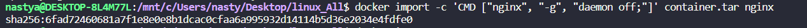

## Part 1. Готовый докер

В качестве конечной цели своей небольшой практики вы сразу выбрали написание докер образа для собственного веб сервера, а потому в начале вам нужно разобраться с уже готовым докер образом для сервера.
Ваш выбор пал на довольно простой **nginx**.

**== Задание ==**

##### Взять официальный докер образ с **nginx** и выкачать его при помощи `docker pull`
 
##### Проверить наличие докер образа через `docker images`

##### Запустить докер образ через `docker run -d [image_id|repository]`

##### Проверить, что образ запустился через `docker ps`

##### Посмотреть информацию о контейнере через `docker inspect [container_id|container_name]`

##### По выводу команды определить и поместить в отчёт размер контейнера, список замапленных портов и ip контейнера
 \
 \

##### Остановить докер образ через `docker stop [container_id|container_name]`

##### Проверить, что образ остановился через `docker ps`

##### Запустить докер с портами 80 и 443 в контейнере, замапленными на такие же порты на локальной машине, через команду *run*

##### Проверить, что в браузере по адресу *localhost:80* доступна стартовая страница **nginx**

##### Перезапустить докер контейнер через `docker restart [container_id|container_name]`
##### Проверить любым способом, что контейнер запустился

## Part 2. Операции с контейнером

Докер образ и контейнер готовы. Теперь можно покопаться в конфигурации **nginx** и отобразить статус страницы.

**== Задание ==**

##### Прочитать конфигурационный файл *nginx.conf* внутри докер контейнера через команду *exec*

##### Создать на локальной машине файл *nginx.conf*
##### Настроить в нем по пути */status* отдачу страницы статуса сервера **nginx**

##### Скопировать созданный файл *nginx.conf* внутрь докер образа через команду `docker cp`
##### Перезапустить **nginx** внутри докер образа через команду *exec*

##### Проверить, что по адресу */status* отдается страничка со статусом сервера **nginx**

##### Экспортировать контейнер в файл *container.tar* через команду *export*

##### Остановить контейнер

##### Удалить образ через `docker rmi [image_id|repository]`, не удаляя перед этим контейнеры

##### Удалить остановленный контейнер

##### Импортировать контейнер обратно через команду *import*

##### Запустить импортированный контейнер

##### Проверить, что по адресу *localhost:80/status* отдается страничка со статусом сервера **nginx**

- В отчёт поместить скрины:
  - вызова и вывода всех использованных в этой части задания команд;
  - содержимое созданного файла *nginx.conf*;
  - страницы со статусом сервера **nginx** по адресу *localhost:80/status*.

## Part 3. Мини веб-сервер

Настало время немного оторваться от докера, чтобы подготовиться к последнему этапу. Настало время написать свой сервер.

**== Задание ==**

##### Написать мини сервер на **C** и **FastCgi**, который будет возвращать простейшую страничку с надписью `Hello World!`
Код находится в папке 03. 
##### Запустить написанный мини сервер через *spawn-fcgi* на порту 8080
##### Написать свой *nginx.conf*, который будет проксировать все запросы с 81 порта на *127.0.0.1:8080*
##### Проверить, что в браузере по *localhost:81* отдается написанная вами страничка
##### Положить файл *nginx.conf* по пути *./nginx/nginx.conf* (это понадобится позже)
все необходимое для этого пункта находится в папке 03. \
Запускаем необходимый контейнер с внешним портом 81 и внутренним 80 и запускаем интерактивную сессию используя оболочку bash.
Так же устанавливаем необходимые для работы библиотеки. \
apt install -y gcc spawn-fcgi libfcgi-dev   \
 \
Открываем вторую консоль и через нее копируем файлы в контейнер. сервер скопируется в корневую папку, а конфигурация заменит собой старую. \
 \
gcc -o run_server server.c -lfcgi \
spawn-fcgi -p 8080 -p ./run_server \
Этими командами создаем исполняемый файл и запускаем spawn-fcgi, который связывает сервер с портом 8080 и запускает исполняемый файл run_server для обработки запросов FastCGI. \
 \
nginx -s reload   \
curl localhost:81/
вывод результата. \

## Part 4. Свой докер

Теперь всё готово. Можно приступать к написанию докер образа для созданного сервера.

**== Задание ==**

*При написании докер образа избегайте множественных вызовов команд RUN*

#### Написать свой докер образ, который:
##### 1) собирает исходники мини сервера на FastCgi из [Части 3](#part-3-мини-веб-сервер)
##### 2) запускает его на 8080 порту
##### 3) копирует внутрь образа написанный *./nginx/nginx.conf*
##### 4) запускает **nginx**.
_**nginx** можно установить внутрь докера самостоятельно, а можно воспользоваться готовым образом с **nginx**'ом, как базовым._

##### Собрать написанный докер образ через `docker build` при этом указав имя и тег
Команда соберает образ из файла Dockerfilе и присвоит ему имя "sever" и тег "new".

##### Проверить через `docker images`, что все собралось корректно

##### Запустить собранный докер образ с маппингом 81 порта на 80 на локальной машине и маппингом папки *./nginx* внутрь контейнера по адресу, где лежат конфигурационные файлы **nginx**'а (см. [Часть 2](#part-2-операции-с-контейнером))
##### Проверить, что по localhost:80 доступна страничка написанного мини сервера

##### Дописать в *./nginx/nginx.conf* проксирование странички */status*, по которой надо отдавать статус сервера **nginx**

##### Перезапустить докер образ
*Если всё сделано верно, то, после сохранения файла и перезапуска контейнера, конфигурационный файл внутри докер образа должен обновиться самостоятельно без лишних действий*
##### Проверить, что теперь по *localhost:80/status* отдается страничка со статусом **nginx**

для полной проверки что все дествительно работает. Запускаем в папке 04 run.sh Этот скрипт соберет образ, даст ему новое имя и тег. и запустит с порта 80 на 81.
## Part 5. **Dockle**
**== Задание ==**
##### Просканировать образ из предыдущего задания через `dockle [image_id|repository]`
##### Исправить образ так, чтобы при проверке через **dockle** не было ошибок и предупреждений
dockle -i CIS-DI-0010 server:server (используется такой ввод. Так как иначе просто не обнаруживает образ) \
отоброжение ошибок. 
 \
для решения проблемы добавляем в докер файл rm -rf /var/lib/apt/lists \
а для решения предупреждения USER dockle \

## Part 6. Базовый **Docker Compose**
**== Задание ==**

##### Написать файл *docker-compose.yml*, с помощью которого:
##### 1) Поднять докер контейнер из [Части 5](#part-5-инструмент-dockle) _(он должен работать в локальной сети, т.е. не нужно использовать инструкцию **EXPOSE** и мапить порты на локальную машину)_
##### 2) Поднять докер контейнер с **nginx**, который будет проксировать все запросы с 8080 порта на 81 порт первого контейнера
##### Замапить 8080 порт второго контейнера на 80 порт локальной машины

##### Остановить все запущенные контейнеры
##### Собрать и запустить проект с помощью команд `docker-compose build` и `docker-compose up`
##### Проверить, что в браузере по *localhost:80* отдается написанная вами страничка, как и ранее
