# Операционные системы UNIX/Linux (Базовый).
## Part 1. Установить **Ubuntu 20.04 Server LTS** без графического интерфейса. (Используем программу для виртуализации - VirtualBox)

- Версия UBANTU, cat /etc/issue \

## Part 2. Создать пользователя, отличного от пользователя, который создавался при установке. Пользователь должен быть добавлен в группу `adm`.

- Создание нового пользователя sudo useradd -G adm user2 \

- Просмотр нового пользователя cat /etc/passwd \

## Part 3. Настройка сети ОС

- Задать название машины user-1, с помощью sudo hostname user-1

- Установка временной зоны, соответствующей моему местоположению timedatectl set-timezone Europe/Moscow

- вывести названия сетевых интерфейсов с помощью консольной команды. \
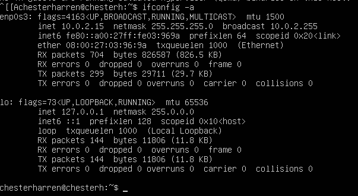

Интерфейс lo является локальной петлёй, имеющей IP-адрес 127.0.0.1. Она предназначена для обеспечения сетевого доступа к компьютеру.

- Получить ip адрес устройства от DHCP сервера: sudo dhclient -v \
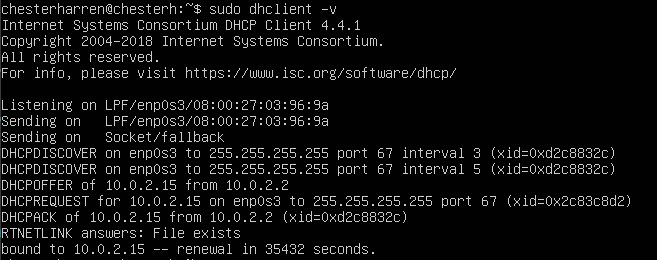 \
DHCP (англ. Dynamic Host Configuration Protocol — протокол динамической настройки узла) — это протокол клиента или сервера, который автоматически предоставляет узел протокола IP с его IP-адресом и другие связанные сведения о конфигурации, такие как маска подсети и шлюз по умолчанию.

- Определить и вывести на экран внешний ip-адрес шлюза (ip) curl ifconfig.me/ip и внутренний IP-адрес шлюза ip route

- задать статичные настройки ip, gw, dns. с помощью команды sudo vim /etc/netplan/00-installer-config.yaml

- пропинговала хосты 

## Part 4 Обновление ОС

- Обновить системные пакеты до последней на момент выполнения задания версии

## Part 5. Использование команды **sudo**

- позволяет выполнять привилегированные команды обычным пользователям без необходимости ввода пароля суперпользователя root

- Чтоб дать возможность изменять имя хоста через другого пользователя, надо sudo usermode -a -G sudo user2 . Для переключения на второго пользователя : su user2. для переименования хоста. sudo hostname use

## Part 6. Установка и настройка службы времени

- вывод информации о времени на компьютере 

## Part 7. Установка и использование текстовых редакторов 

- редактор **vim**. для сохранения нажать (esc :w), для выхода (esc :q!) \
 

редактор **nano**. для выхода с сохранением изменений (cntrl + x - yes - entr) \
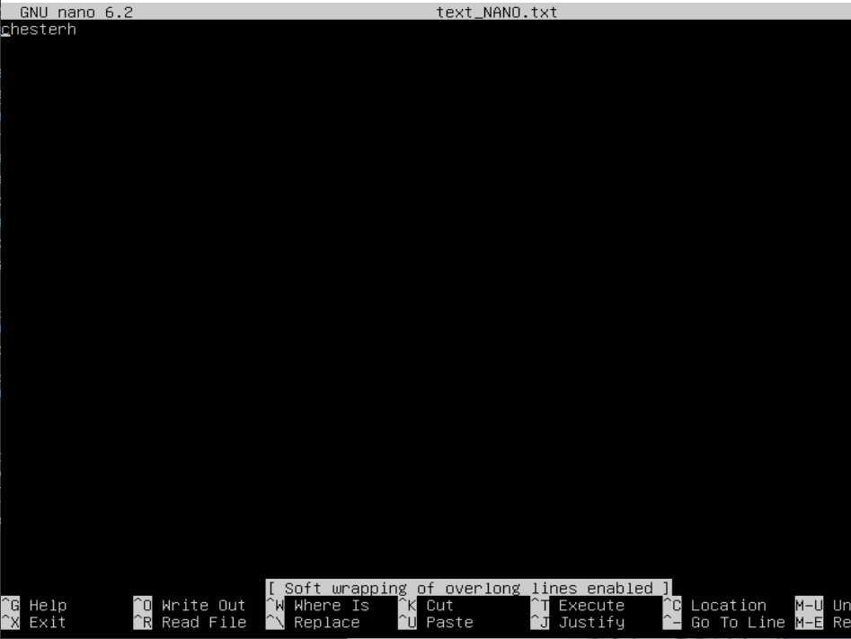 \
редактор **joe**. для выхода с сохранением изменений (ctrl+k, x)  \
 \
редактор **vim**.  для выхода (esc :q!) \
 \
 редактор **nano**. для выхода с сохранением изменений (cntrl + x - no - entr) \
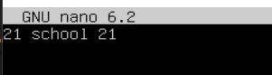 \
**joe** для выхода без сохранения (ctrl+c - y)\
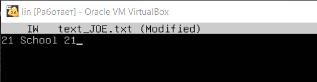\

## Part 8. Установка и базовая настройка сервиса **SSHD**

- установка sudo apt install openssh-server

- автостарт службы sudo systemctl enable ssh

- результат перенастройки службы 

- ps -C sshd 
команда ps позволяет просмотреть список всех текущих процессов. 
Флаг -С - выбирать процессы по имени команды

- для перезагрузки использвала sudo shutdown -r now

- netstat (network statistics) — утилита командной строки, выводящая на дисплей состояние TCP-соединений. Опции –t показывают активные соединения TCP, флаг –a , также будут показаны сокеты, ожидающие соединения, -n показывает сетевые адреса как числа. netstat обычно показывает адреса как символы. Этот дисплей даст вам список всех серверов, которые в настоящее время работают в вашей системе.

Proto – протокол (tcp, udp). 

Recv-Q – количество байтов, помещённых в буфер приёма TCP/IP, но не переданных приложению.

Send-Q – количество байтов, помещённых в буфер отправки TCP/IP, но не отправленных, или отправленных, но не подтверждённых 

Local Address – локальный адрес сервера. 

Foreign Address – адрес второй стороны. В обычных соединения, это адрес с которого пришло соединение. 0.0.0.0:* – значит подключаться можно с любых адресов и с любых портов. 

State – состояние подключения, или прослушивания

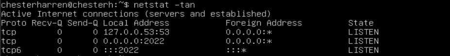

## Part 9.  Установка и использование утилит **top**, **htop**

установка и запуск утилиты top и htop 
uptime - 01:22:04

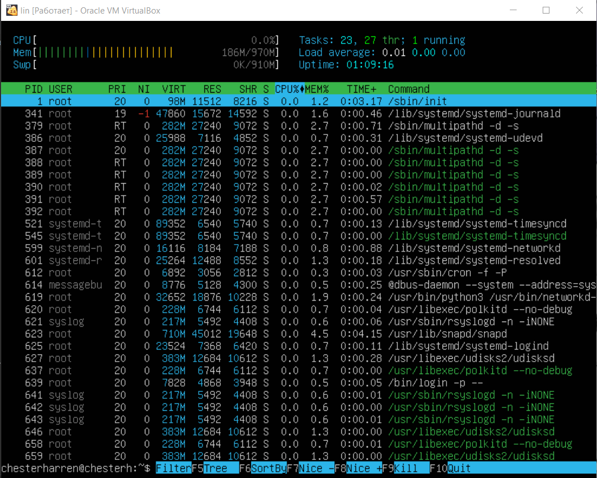

количество авторизованных пользавателей - 1 

общую загрузку системы - 185,3 

общее количество процессов - 97 

загрузку cpu - 0 

загрузку памяти - 970 

pid процесса занимающего больше всего памяти - 623 

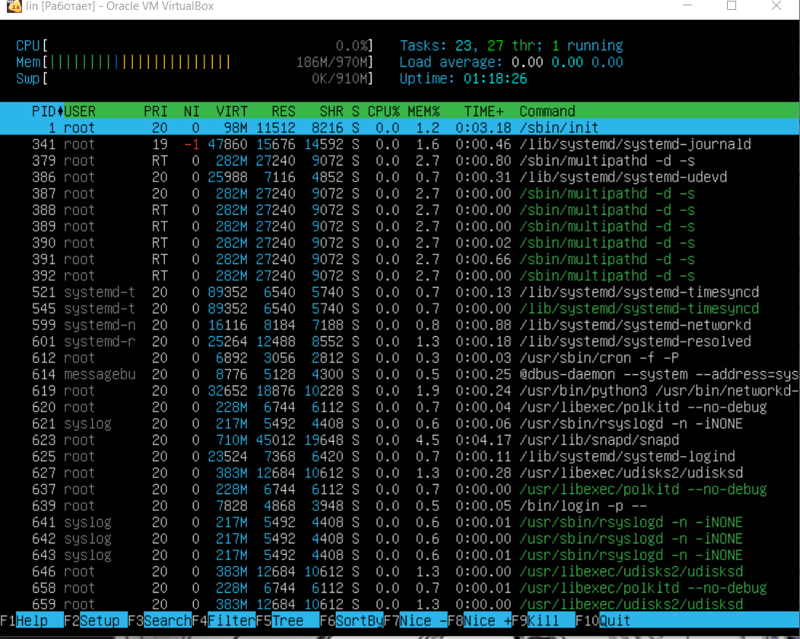

pid процесса, занимающего больше всего процессорного времени - 623

 

сортировка по PERCENT_CPU

сортировка по PERCENT_MEM

сортировка по TIME

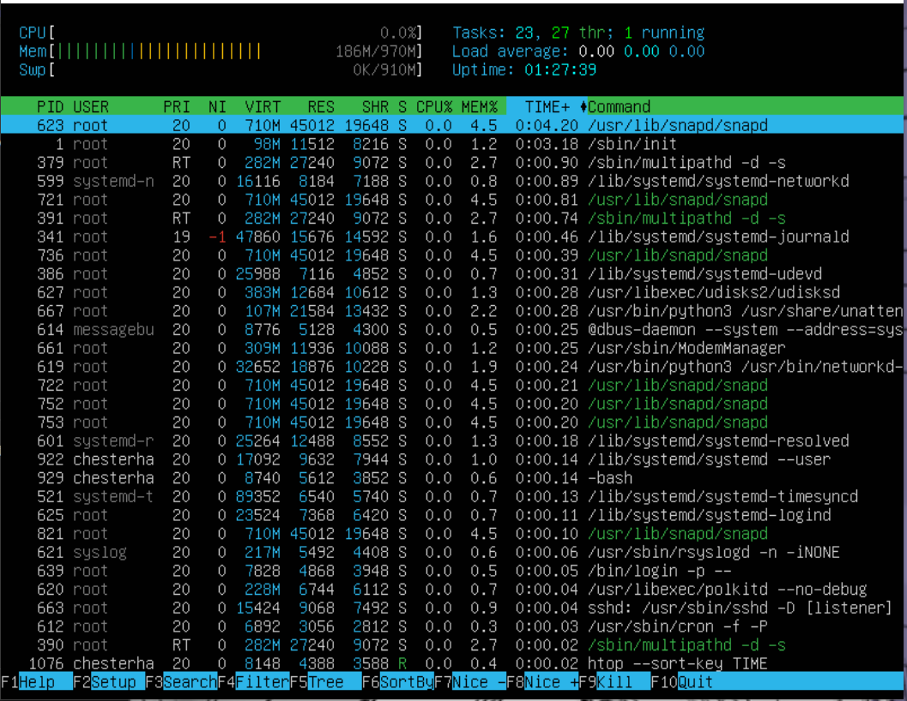

фильтровка для процесса sshd

с процессом syslog, найденным, используя поиск

с добавленным выводом hostname, clock и uptime

## part 10. Использование утилиты **fdisk**

- запустить каманду fdisk -1 
Название жесткого диска sda Размер - 8 gib. Кол-во сектаров - 13101056. Размер swap - 0

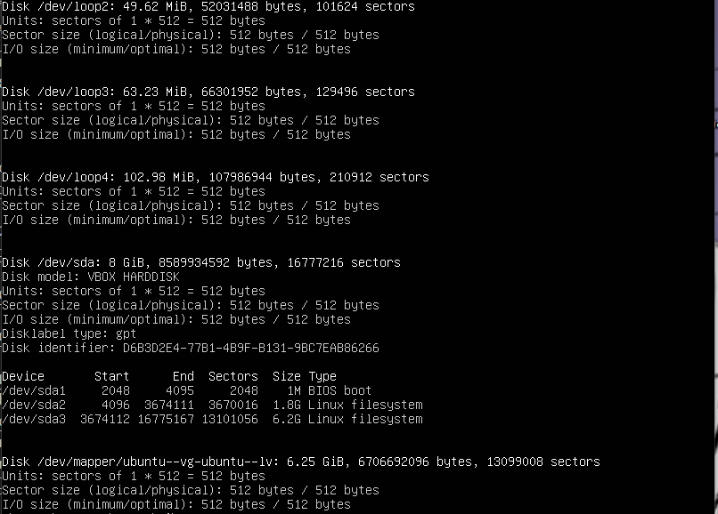

## Part 11. Использование утилиты **df**

размер раздела - 6342332, размер занятого пространства - 4059184, размер свободного пространства - 1949292, процент использования - 68%
тип файловой системы - /dev/mapper/ubuntu--vg-ubuntu-lv

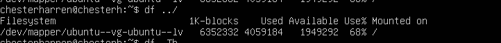

## Part 12. Использование утилиты **du**
- вызов du\
  \
- вывод размеров папок /home \
\
  вывод размеров папок /var \
\
  вывод размеров папок /var/log \
\
- Вывести размер всего содержимого в /var/log (не общее, а каждого вложенного элемента, используя *) \
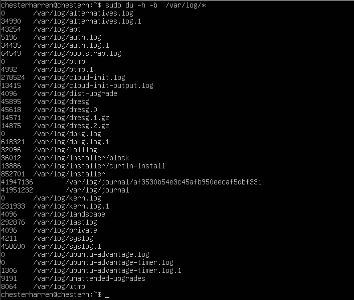

## Part 13. Установка и использование утилиты **ncdu**
- установка ncdu : sudo apt install ncdu
- ncdu /home = 51.3 KiB\
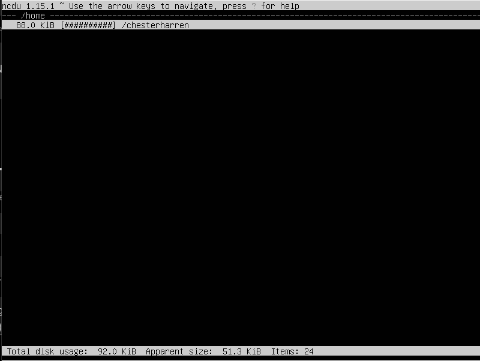\
ncdu /var = 785.9 MiB \
\
  ncdu /var/log  = 43.0 MiB \

## Part 14. Работа с системными журналами
- less /var/log/dmesg \

\
- less /var/log/syslog \
\
- less /var/log/auth.log \
 \
время последней успешной авторизации - 11:17:43 \
имя пользователя - chesterh \ 
метод входа в систему - sudo \
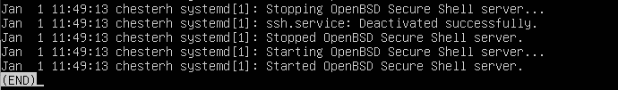

## Part 15. Использование планировщика заданий **CRON**
- Используя планировщик заданий, запустите команду uptime через каждые 2 минуты \
 \
- строки о выполнение задачи через каждые 2 минуты \
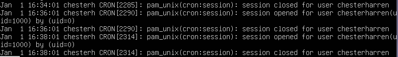 \
- удаление всех заданий с помощью crontab -r \
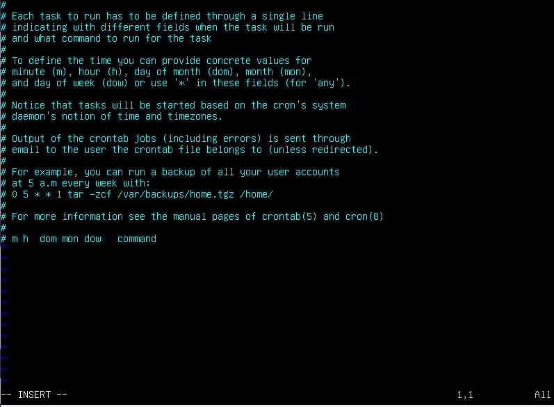