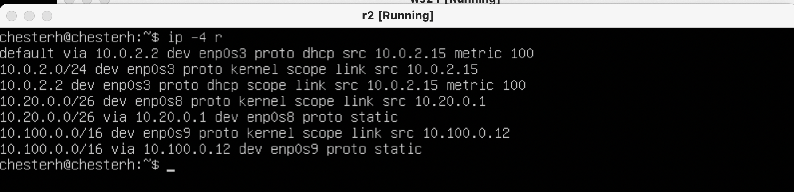

# Сети в линукс

## Part 1. Инструмент **ipcalc**

- Адрес сети:  \

вывод с использованием ipcalc 192.167.38.54/13
перевод маски *255.255.255.0* в префиксную и двоичную запись,  \
 \
перевод /15 в обычную и двоичную     
  \
перевод *11111111.11111111.11111111.11110000* в обычную и префиксную. Пишем 28 т.к.маска содержит в себе 28 единиц.  \
 
- минимальный и максимальный хост для маски /8  \
  \
мнимальный и максимальный хост для маски 16  \

минимальный и максимальный в сети 12.167.38.4 при маске 23
 \
минимальный и максимальный в сети 12.167.38.4 при маске 4 \
 
- Для localhost зарезервирован диапазон ip 127.0.0.1 - 127.255.255.254. Поэтому обратиться к приложению, работающем на localhost с IP 194.34.23.100 и 128.0.0.1 мы не сможем, тогда как к IP 127.0.0.2 и 127.1.0.1 сможем.
- в качестве частных: 10.0.0.45, 192.168.4.2, 172.20.250.4, 172.16.255.255, 10.10.10.10 \
в качестве публичных: 134.43.0.2, 172.0.2.1, 192.172.0.1, 172.68.0.2, 192.169.168.1
- Возможные IP адреса шлюза: 10.10.0.2, 10.10.10.10, 10.10.1.255
## Part 2. Статическая маршрутизация между двумя машинами
- С помощью команды `ip a` посмотреть существующие сетевые интерфейсы
для ws1 \
 \
для ws2 \

- Описать сетевой интерфейс, соответствующий внутренней сети, на обеих машинах и задать следующие адреса и маски: ws1 - *192.168.100.10*, маска */16*, ws2 - *172.24.116.8*, маска */12*
измененный файл *vi /etc/netplan/00-installer-config.yaml* для ws1 \
 \
измененный файл *etc/netplan/00-installer-config.yaml* для ws2 \
 \
- Выполнить команду `netplan apply` для перезапуска сервиса сети
netplan apply для ws1 \
 \
netplan apply для ws2 \

- Добавить статический маршрут от одной машины до другой и обратно при помощи команды вида `ip r add`
добавление статического маршрута для ws1 \
 \
Добавление статистического маршрута для ws2 \
 \
пропинговала соединение между раб.станциями. слева wm2 справа wm1 \

- Добавить статический маршрут с сохранением 
слева ws1 справа ws2 используем sudo netplan apply

-пингуем машины \
пропинговка ws1
 \
пропинговка ws2

## Part 3. Утилита iperf3
Скорость соединения
- 8 Mpbs = 1 MB/s
- 100 MB/s = 800000 Kbps
- 1 Gbps = 1000 Mbps

-скорость соединения между ws1, установленной как сервер при помощи команды iperf3 -s с последующим измерением скорости соединения,
 \
и ws2 установленной как принимающее устройство с помощью команды iperf3 -c 192.168.100.10 -p 5201 с последующим измерением скорости соединения \

## Part 4. Сетевой экран
- создание файла имитирующего фаерволл для ws1 \
 \
создание файла имитирующего фаерволл для ws2 \
 
- на ws1 применить стратегию когда в начале пишется запрещающее правило, а в конце пишется разрешающее правило
- на ws2 применить стратегию когда в началк пишется разрешающее правило, а в конце пишется запрещающее слово
- открыть на раб. станциях 
на скриншоте справа ws1, слева - ws2 \
 \
Результат выполнения команды chmod +x /etc/firewall.sh и /etc/firewall.sh 

- Разница в стратегиях: \
На ws2 мы сначала разрешили пинг а потом запретили пинг. Так как мы написали его раньше запрещающего, то пинг разрешен. 
В то время как на ws1 мы написали сначала запрет и потом разрешение. Следовательно пинг не будет разрешен 
- 4.2 Утилита nmap \
мы не смогли пропинговать ws2. Но можно увидеть, что подключение к хосту есть 
 \
пинг ws1 \

## Part 5. Статическая маршрутизаия
- Содержание файла etc/netplan/00-installer-config.yaml для  ws1 \
 \
Содержание файла etc/netplan/00-installer-config.yaml для  ws2 \
 \
Содержание файла etc/netplan/00-installer-config.yaml для ws22 \
 \
Содержание файла etc/netplan/00-installer-config.yaml для r1 \

Содержание файла etc/netplan/00-installer-config.yaml для r2 \

- Настройка адресов раб. станций \
проверка адресов на ws11 \
 \
проверка адресов на ws21 \
 \
проверка адресов на ws22 \
 \
проверка адресов на r1 \
 \
проверка адресов на сервере r2 \
 \
- включение переадресации IP-адресса
 \
Откройте файл /etc/sysctl.conf и добавьте в него следующую строку:
net.ipv4.ip_forward = 1 \
для первого роутера \
 \
для второго роутера \

- 5.3. Установка маршрута по-умолчанию
 \
 \
 \
 \
 

- 5.4. Добавление статических маршрутов \
добавление маршрутов для r1 и r2 \
 \
просмотр списков для r1 b r2
 \
просмотр спискв для ws11
 
- почему для адреса 10.10.0.0/[маска сети] был выбран маршрут, отличный от 0.0.0.0/0, хотя он попадает под маршрут по-умолчанию. \
Так как приоритетно выбирается маршрут с более длинной маской

- 5.5. Построение списка маршрутизаторов
вывода утилиты traceroute после добавления шлюза:

## Part 6. Динамическая настройка IP с помощью DHCP
указать адрес маршрутизатора по-умолчанию, DNS-сервер и адрес внутренней сети. Пример файла для r2 \
 \
в файле resolv.conf прописать nameserver 8.8.8.8. \
 \
Перезагрузить службу DHCP командой systemctl restart isc-dhcp-server

перезапуск машины ws21 и выдача ему нового адреса \
![перезапуск  ws21(screens/task6.1_w21.png) \
пинг двух раб.станций \
 \
Указать MAC адрес у ws11 \
  
r1 настроить аналогично r2, но сделать выдачу адресов с жесткой привязкой к MAC-адресу (ws11). 
 \
в файле resolv.conf прописать nameserver 8.8.8.8. \
 \
применение 

ip a для  ws11
  
ip для ws21 до того как обновили адрес \

ip для ws21 после того как обновили адрес \
 \
для данного пункта использовала sudo dhclient enp0s8. При запуске dhclient читает dhclient.conf для получения инструкций по настройке.
## Part 7. NAT
В файле /etc/apache2/ports.conf на r1 изменить строку Listen 80 на Listen 0.0.0.0:80 \
 \

В файле /etc/apache2/ports.conf на ws22 изменить строку Listen 80 на Listen 0.0.0.0:80 \
 \
Запустить веб-сервер Apache командой service apache2 start на ws22 \
 \
Запустить веб-сервер Apache командой service apache2 start на r1 \
 \
Добавить в фаервол, на r2 следующие правила \
 \
запуск файерволла \
 \
Проверить соединение между ws22 и r1 командой ping \
 \
станции не пингуются друг с другом 
- Разрешить маршрутизацию всех пакетов протокола ICMP

 \
пропинговали r1 и ws22 \

- Включить SNAT, а именно маскирование всех локальных ip из локальной сети, находящейся за r2 (по обозначениям из Части 5 - сеть 10.20.0.0)
 \
добавление DNAT

проверить соединение по TCP для SNAT \
проверяем соединение ws22 - r1 \
 \
проверяем соединение r1 - ws22 \

## task 8
- Запустить веб-сервер Apache на ws22 только на localhost 

- Воспользоваться Local TCP forwarding с ws21 до ws22, чтобы получить доступ к веб-серверу на ws22 с ws21 \
 \
- оспользоваться Remote TCP forwarding c ws11 до ws22, чтобы получить доступ к веб-серверу на ws22 с ws11 \
 \
telnet \
